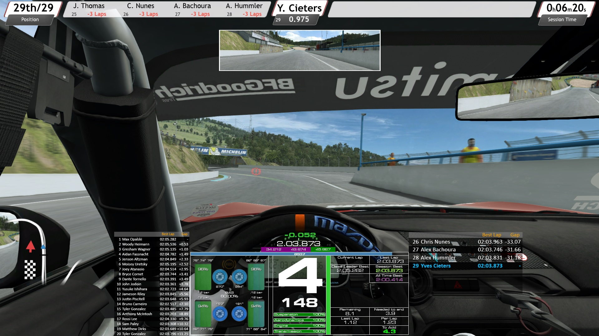
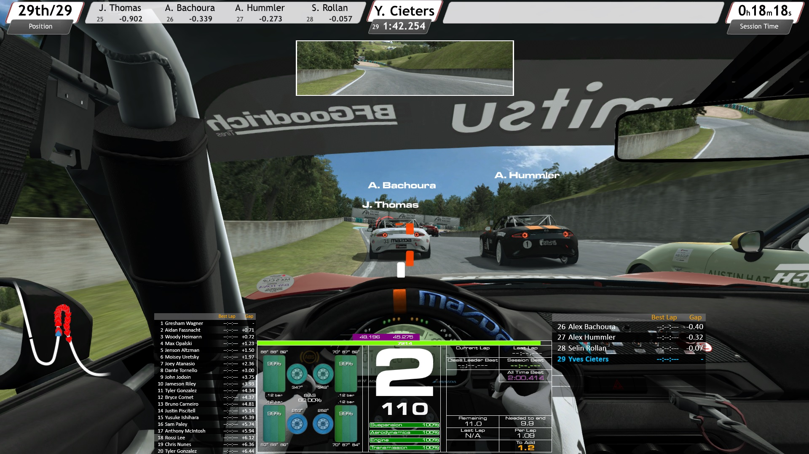
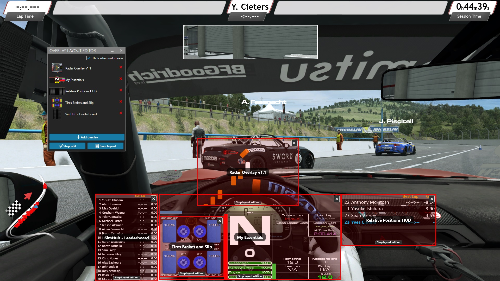

# R3E SimHub Overlays

## SimHub Overlays for use with Raceroom Racing Experience

This is a small collection of Simhub overlays I use for Raceroom Racing Experience

The central cluster and the tire monitor were created by myself.
The radar and the leaderboards were created by others and modified to my personal preference.

While these SimHub overlays are quite usable and helpful for me in their current state, they are still a work in progress with some known issues and room for improvement.
I built these for myself as an alternative to a very popular R3E webhud that was failing me, causing ruined races and blank screens.
I'm happy with the results so far and thought they might be worth sharing.
If you find any issues or have suggestions, feel free to create a github issue.
I'm not making any promises as this is more of a personal playground than it is a proper open source endeavour.

Have fun on the virtual track!

&nbsp;&nbsp;&nbsp;&nbsp;&nbsp;&nbsp;

## How to use

1. You'll need to have [Simhub](https://www.simhubdash.com/) installed on your PC. 
2. Download the [overlays.zip](https://github.com/YvesCieters/R3E_SimHub_Overlays/releases) from the latest release.
3. Extract the zip file and doubleclick each overlay. This will import the overlay in Simhub.
4. Create an overlay layout in Simhub and add the imported overlays into it. 
     > [Check this quick explanation by Adam Heart if you don't know how.](https://www.youtube.com/watch?v=uVQ-F_DwkfI)

## Wheelslip plugin by Viper4gh

The Tires brakes and slip overlay has a visual representation of wheelspin and locking. 
For this to work, you'll need the [wheelslip plugin](https://github.com/viper4gh/SimHub-Plugin-CalcLngWheelSlip) that was created by viper4gh.

Get the [latest version](https://github.com/viper4gh/SimHub-Plugin-CalcLngWheelSlip/releases) and copy the "Viper.PluginCalcLngWheelSlip.dll" file to your Simhub installation folder.
